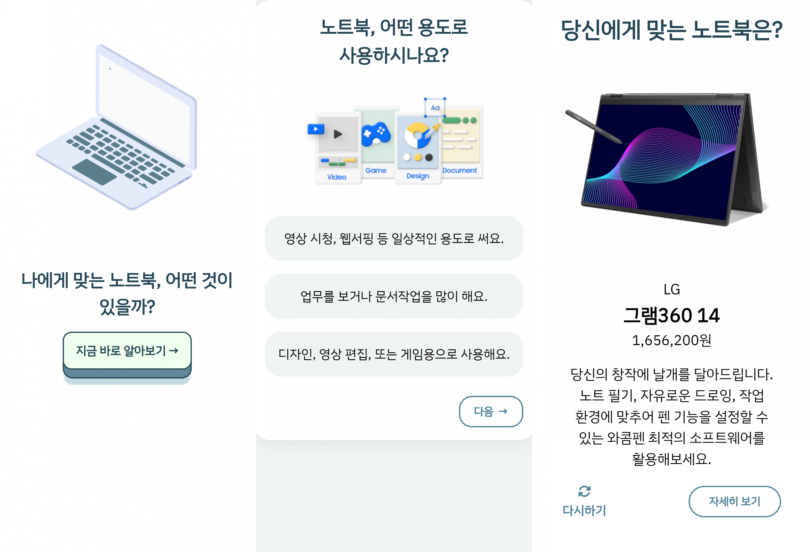

# eBook

### 🔗링크
https://asdf080.github.io/Laptop-intro/

### 🔎소개
노트북의 기종과 브랜드에 대해 설명하는 웹페이지입니다.

### 📅제작 기간
2024.01.17 ~ 2024.01.31

### 🗂개발 환경
- HTML
- CSS
- JavaScript

### 🎈주요 기능
- 모든 디스플레이 크기를 지원하는 반응형 디자인
- 다크 모드/라이트 모드 토글 버튼
- 많은 정보를 한눈에 볼 수 있는 캐러셀 슬라이드와 토글 메뉴
- getBoundingClientRect를 활용한 스크롤 연동 CSS 애니메이션
- 오픈 API를 활용한 카카오맵 서비스
- 심리테스트 사이트를 오마주한 노트북 찾기 서브 페이지

### 📏와이어 프레임
[Figma 링크](https://www.figma.com/file/KbxjzItSk3V23GCEuK1Awu/Laptop-wireframe?type=design&node-id=0-1&mode=design&t=qxcW5hrLb26OP4vM-0)

### 📊PPT 보고서
[Google Drive 링크](https://docs.google.com/presentation/d/1T2YFJQZns3f-Wm03AF-GBAVyLRNimz5_/edit?usp=drive_link&ouid=103946871395412632007&rtpof=true&sd=true)

### ✔ 미리보기
- 메인 페이지

- 서브 페이지

